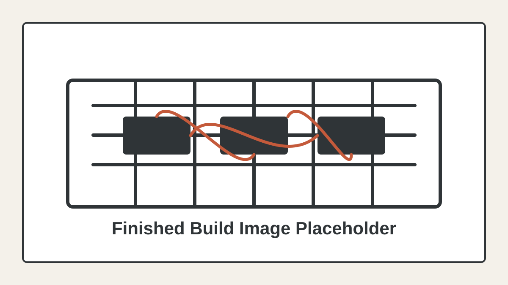

# 6502 Computer Build



This repository documents my personal Ben Eater-style 6502 breadboard computer build. The target final state is the computer shown through part 7 of the 6502 video series, with code, datasheets, notes, and progress media kept together as the project develops.

## Current Status

- Target: Ben Eater 6502 computer through part 7.
- Working so far: EEPROM, W65C22 VIA, and HD44780 LCD output.
- Current focus: connecting and debugging RAM behavior.

## Hardware

- W65C02S CPU
- AT28C256 EEPROM
- HM62256 SRAM
- W65C22 VIA
- HD44780-compatible LCD
- 74HC00 NAND gates for address decoding

## Repository Layout

- `code/` - 6502 assembly examples, Arduino monitor sketches, ROM-generation scripts, and ROM binaries.
- `docs/` - datasheets for the CPU, VIA, EEPROM, RAM, LCD, and support chips.
- `notes/` - project goals, architecture notes, computer fundamentals, and remaining work.
- `Imgs/` - build photos and progress videos.

## Useful Commands

Regenerate the early ROM image:

```bash
cd code && python3 rom1.py
```

Assemble a 6502 program with the Ben Eater toolchain:

```bash
vasm6502_oldstyle -Fbin -dotdir code/program1.s -o code/program1.bin
```

Open `code/monitor1.ino` in the Arduino IDE, or upload it with `arduino-cli`, to monitor the address and data buses.

## Documentation

- [Code stages](code/README.md)
- [Project goals](notes/project_goals.md)
- [Low-level architecture](notes/low-level-architecture.md)
- [Computer fundamentals](notes/computer_fundamentals.md.md)
- [Remaining work](notes/To_finish.md)

## Validation

There is no automated test suite. Changes are checked by rebuilding ROM binaries, verifying reset vectors and memory addresses, and testing behavior on the breadboard with the Arduino monitor or direct hardware observation.
