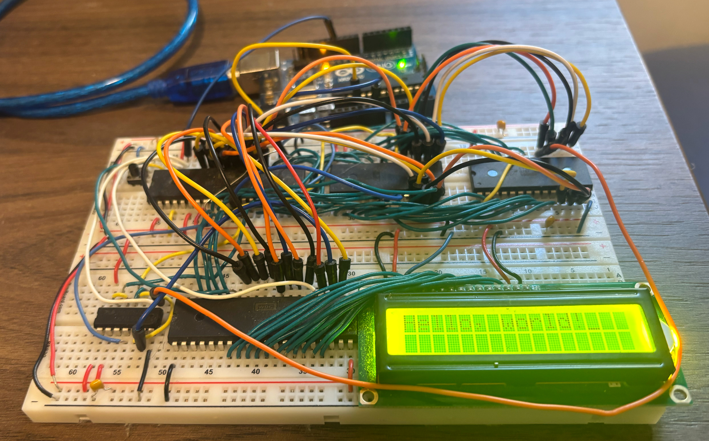
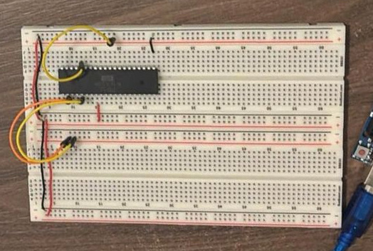
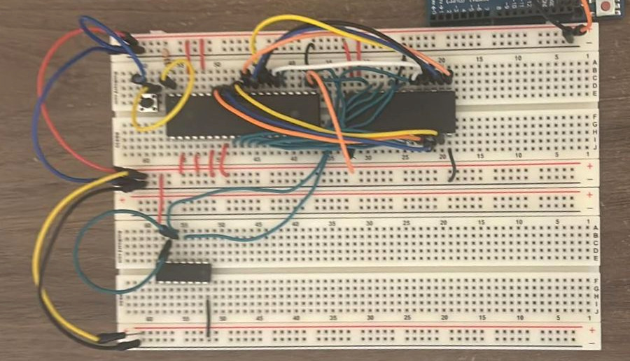
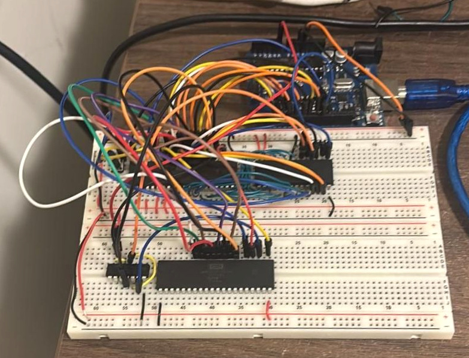
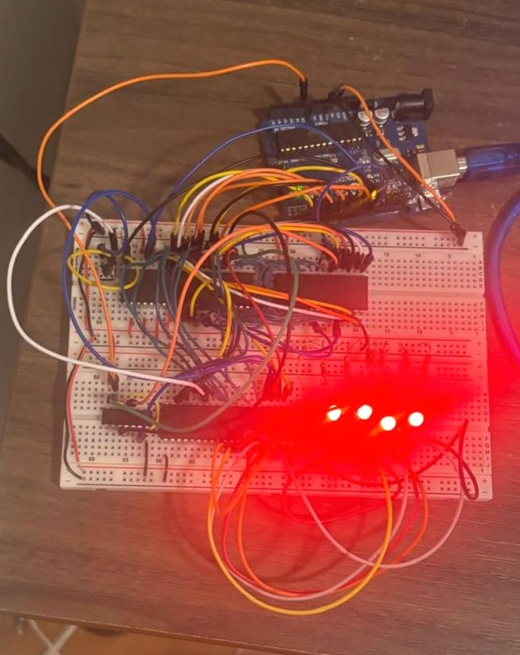
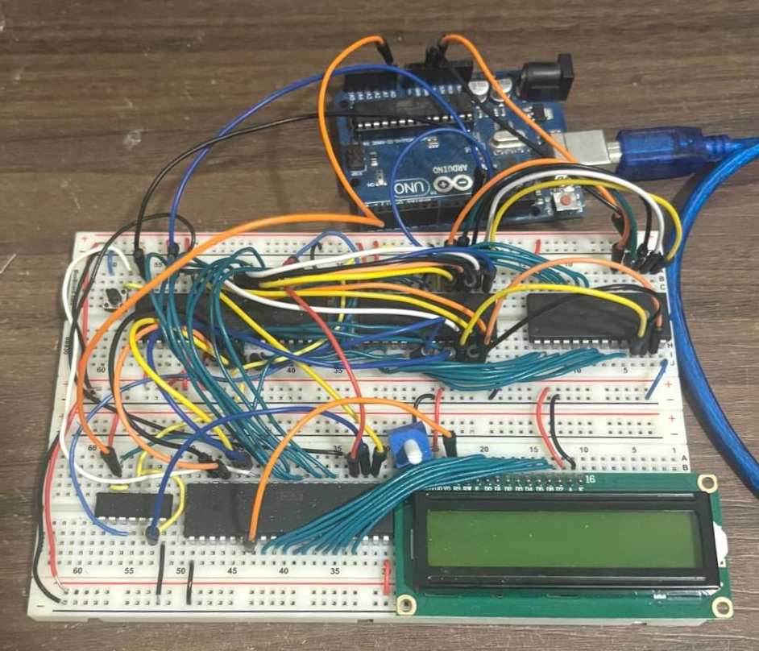

# 6502 Computer Build

Sorry for the quality of the images and videos! I didn’t know I was going to upload this project to GitHub—they were originally just for me to keep track of my progress.

[Watch the final full-build Hello World demo (6× speed, no audio)](Imgs/final-full-build-hello-world-6x.mp4).

This repository documents my personal Ben Eater-style 6502 breadboard computer build. The build is finished through Part 7 of the 6502 video series, with code, datasheets, notes, and progress media documenting the journey.

## Current Status

- Status: **Finished**.
- Completed: Ben Eater 6502 computer through **Part 7**.

## Hardware

- W65C02S CPU
- AT28C256 EEPROM
- HM62256 SRAM
- W65C22 VIA
- HD44780-compatible LCD
- 74HC00 NAND gates for address decoding

## Repository Layout

- `code/` - build code in three groups: `machine_code/` (hand-written opcodes and ROM images), `assembly/` (6502 assembly source), and `debug/` (Arduino monitor sketches).
- `docs/` - datasheets for the CPU, VIA, EEPROM, RAM, LCD, and support chips.
- `notes/` - project goals, low level details, and full summery.
- `Imgs/` - build photos and progress videos.

## Build Photos

Earlier stages of the build, leading up to the finished computer shown above.

## Documentation

- [Code stages](code/README.md)
- [Project goals](notes/project_goals.md)
- [Low-level architecture](notes/low-level-architecture.md)
- [Computer fundamentals](notes/how_6502_works.md)

## Validation

There is no automated test suite. Changes are checked by rebuilding ROM binaries, verifying reset vectors and memory addresses, and testing behavior on the breadboard with the Arduino monitor or direct hardware observation.
